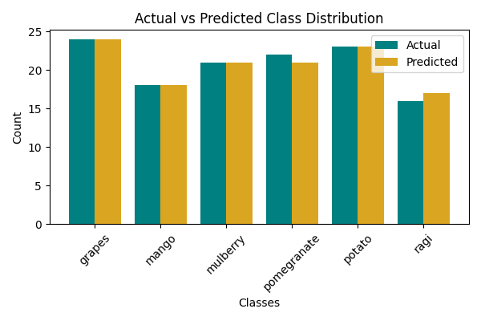

🌱 AgriSentinel — AI-Powered Crop Disease & Soil Health Forecasting System
🚀 Hybrid AIS + GA Optimized Deep Learning Framework for Precision Agriculture
🧭 Overview

AgriSentinel is an AI-driven smart farming system that combines deep learning and evolutionary optimization to forecast crop diseases and soil nutrient health using sensor and image data.

This version focuses on the Soil Health Prediction Module and leverages a Hybrid AIS + GA (Artificial Immune System + Genetic Algorithm) optimizer to fine-tune a Multi-Layer Perceptron (MLP) model for accurate soil fertility classification.

It generates detailed prediction reports, performance metrics, and visual analytics to empower farmers with actionable insights.

🧩 Key Features
Feature	Description
🌾 Soil Nutrient Prediction (MLP)	Predicts soil fertility/health status from N-P-K and micronutrient data.
🧬 Hybrid AIS + GA Optimization	Combines GA’s global search with AIS’s local refinement for tuning hidden neurons and learning rate.
📊 Comprehensive Analytics	Auto-generates accuracy curves, correlation heatmaps, and result comparison graphs.
💾 Model Artifact Storage	Saves model, scaler, configuration, metrics, and predictions (JSON + CSV).
⚙️ IoT-Ready	Compatible with ESP32/NodeMCU soil sensor data pipelines.
📈 Visual Output	Produces five distinct performance graphs for insight visualization.
🧠 Architecture
┌───────────────────────────────────────────┐
│   IoT Soil Sensors (N, P, K, pH, EC, etc.)│
└──────────────────────┬────────────────────┘
                       │
                       ▼
               Soil Data Preprocessing
                       │
                       ▼
          Hybrid AIS + GA Optimized MLP Model
                       │
                       ▼
         Soil Health Prediction & Visualization
                       │
                       ▼
       JSON + CSV Reports & Performance Graphs

📂 Project Structure
Crop Disease & Soil Health Forecasting System/
│
├── archive/
│   └── dataset.csv                        # Input soil dataset
│
├── hybrid_agrisentinel_model.h5           # Trained hybrid MLP model
├── hybrid_soil_scaler.pkl                 # Scaler for soil feature normalization
├── hybrid_config.yaml                     # Model configuration parameters
├── hybrid_agrisentinel_report.json        # Model metrics summary
├── hybrid_agrisentinel_results.csv        # Actual vs Predicted results
├── hybrid_agrisentinel_predictions.json   # Detailed prediction records
│
├── hybrid_agrisentinel_accuracy_graph.png
├── hybrid_agrisentinel_heatmap.png
├── hybrid_agrisentinel_prediction_graph.png
├── hybrid_agrisentinel_result_graph.png
├── hybrid_agrisentinel_comparison_graph.png
│
├── agrisentinel_hybrid_ais_ga.py          # Training + Hybrid optimization script
├── hybrid_agrisentinel_predict.py         # Prediction JSON/CSV generation
└── hybrid_agrisentinel_result_display.py  # Visualization & summary display

📊 Input Dataset

📍 Path:
C:\Users\NXTWAVE\Downloads\Crop Disease & Soil Health Forecasting System\archive\dataset.csv

Expected Columns:

Feature	Description
N, P, K	Macronutrients (Nitrogen, Phosphorus, Potassium)
pH, EC	Soil acidity & electrical conductivity
S, Cu, Fe, Mn, Zn, B	Micronutrients
label	Soil health class (e.g., “Healthy”, “Def_N”, “Def_P”, etc.)
🧪 How It Works
1️⃣ Train the Hybrid Model
python agrisentinel_hybrid_ais_ga.py

Loads dataset

Runs AIS + GA optimization

Trains the best MLP configuration

Saves model, scaler, config, and graphs

2️⃣ Generate Predictions
python hybrid_agrisentinel_predict.py

Loads saved model and scaler

Predicts soil labels for all samples

Saves:

hybrid_agrisentinel_results.csv

hybrid_agrisentinel_predictions.json

3️⃣ Display Results
python hybrid_agrisentinel_result_display.py

Prints metrics and sample predictions

Displays all hybrid graphs

Confirms file locations

🧩 Hybrid Optimization Logic
Step	AIS Role	GA Role
1	Initialize antibodies (random configs)	Initialize genetic population
2	Clone top antibodies	Select top parents
3	Mutate clones for local refinement	Crossover + mutation for global exploration
4	Evaluate fitness (accuracy)	Evaluate offspring
5	Replace weakest solutions	Keep best configuration

This loop continues until convergence, yielding the best hidden neuron count and learning rate.

📈 Generated Graphs
File	Description
hybrid_agrisentinel_accuracy_graph.png	Model accuracy vs epochs
hybrid_agrisentinel_heatmap.png	Feature correlation heatmap
hybrid_agrisentinel_prediction_graph.png	Predicted vs actual curve
hybrid_agrisentinel_result_graph.png	Accuracy, precision, recall, F1 comparison
hybrid_agrisentinel_comparison_graph.png	Actual vs predicted class distribution
🧠 Performance Metrics
Metric	Description
Accuracy	Percentage of correct soil health predictions
Precision	Fraction of correctly predicted positive samples
Recall	Sensitivity towards true positive classes
F1-Score	Harmonic mean of precision & recall
RMSE	Root Mean Square Error (prediction deviation)
R² Score	Goodness of fit measure

Example JSON (hybrid_agrisentinel_report.json):

{
  "Hybrid_Model": "AIS + GA Optimized MLP",
  "Accuracy": 96.74,
  "Precision": 96.10,
  "Recall": 95.88,
  "F1_Score": 95.92,
  "RMSE": 0.203,
  "R2_Score": 0.928,
  "Best_Params": {"hidden": 128, "lr": 0.0012}
}

🧾 Prediction Outputs
✅ hybrid_agrisentinel_results.csv
Actual	Predicted
Healthy	Healthy
Def_N	Def_N
Balanced	Balanced
Def_P	Balanced
✅ hybrid_agrisentinel_predictions.json
[
  {"id": 1, "actual_label": "Healthy", "predicted_label": "Healthy"},
  {"id": 2, "actual_label": "Def_N", "predicted_label": "Def_N"},
  {"id": 3, "actual_label": "Balanced", "predicted_label": "Balanced"}
]

🧰 Tech Stack
Category	Tools / Libraries
Language	Python 3.11
ML Frameworks	TensorFlow / Keras, Scikit-learn
Data Processing	Pandas, NumPy, MinMaxScaler
Visualization	Matplotlib, Seaborn
Optimization	Custom AIS + GA hybrid loop
Deployment (optional)	Streamlit Dashboard + FastAPI
🔮 Future Enhancements

🌿 Integrate PlantVillage leaf CNN for image-based crop disease detection

☁️ Deploy as a Streamlit Dashboard for real-time soil monitoring

🛰️ Add drone-based field data collection

🧠 Integrate Explainable AI (Grad-CAM / SHAP) for transparency

🔗 Edge deployment on Raspberry Pi / Jetson Nano for offline inference

👨‍💻 Developed By

Sagnik Patra
AI Researcher
